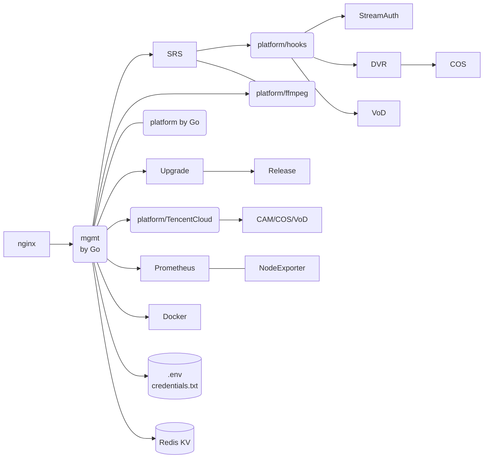
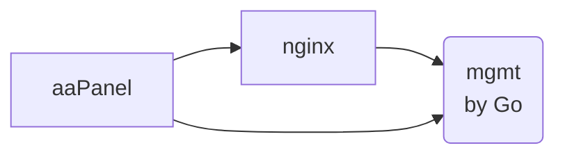

# Developer

This guide is for developers and covers topics such as OpenAPI, environment variables, 
resources, and ports, as well as development on Mac or using Docker.

## Develop All in macOS

Start redis and SRS by docker:

```bash
docker run --name redis --rm -it -v $HOME/db/redis:/data -p 6379:6379 -d redis &&
docker run --name srs --rm -it \
    -v $(pwd)/platform/containers/conf/srs.release-mac.conf:/usr/local/srs/conf/srs.conf \
    -v $(pwd)/platform/containers/objs/nginx:/usr/local/srs/objs/nginx \
    -p 1935:1935/tcp -p 1985:1985/tcp -p 8080:8080/tcp -p 8000:8000/udp -p 10080:10080/udp \
    -d ossrs/srs:5
```

> Note: Stop service by `docker rm -f redis srs`

> Note: Also, you can run SRS by `(cd platform && ~/git/srs/trunk/objs/srs -c containers/conf/srs.release-local.conf)`

Run the platform backend, or run in GoLand:

```bash
(cd platform && go run .)
```

Run the platform react ui, or run in WebStorm:

```bash
(cd ui && npm install && npm start)
```

Access the browser: http://localhost:3000

## Develop All in One Docker

Run srs-cloud in a docker.

First, build image:

```bash
docker rmi platform-dev 2>/dev/null || echo 'OK' &&
docker build -t platform-dev -f Dockerfile.dev .
```

Then start the development docker:

```bash
docker rm -f platform 2>/dev/null || echo 'OK' &&
docker run -d --rm -it -p 2022:2022 --name platform -v $(pwd):/usr/local/srs-cloud \
  --add-host redis:127.0.0.1 --env REDIS_HOST=127.0.0.1 --add-host mgmt.srs.local:127.0.0.1 \
  --env CLOUD=DOCKER --env MGMT_DOCKER=true --env SRS_DOCKERIZED=true --env NODE_ENV=development \
  -p 1935:1935/tcp -p 1985:1985/tcp -p 8080:8080/tcp -p 8000:8000/udp -p 10080:10080/udp \
  -w /usr/local/srs-cloud platform-dev bash
```

> Note: We don't use the `/data` as global storage.

Build platform and UI in docker:

```bash
docker exec -it platform make -j
```

Run platform in docker:

```bash
docker exec -it platform ./platform/bootstrap
```

Stop redis and SRS:

```bash
docker rm -f platform
```

It's the same as production online.

## Develop the Script Installer

Build a docker image:

```bash
docker rm -f platform 2>/dev/null || echo 'OK' &&
docker rmi test 2>/dev/null || echo 'OK' &&
docker build -t test -f Dockerfile.script .
```

Create a docker container in daemon:

```bash
docker rm -f platform 2>/dev/null || echo 'OK' &&
docker run \
    -p 2022:2022 -p 1935:1935/tcp -p 1985:1985/tcp -p 8080:8080/tcp -p 8000:8000/udp -p 10080:10080/udp \
    --privileged -v /sys/fs/cgroup:/sys/fs/cgroup:rw --cgroupns=host \
    -d --rm -it -v $(pwd):/g -w /g --name=platform test
```

Build and save the platform image to file:

```bash
docker rmi platform:latest 2>/dev/null || echo OK &&
docker build -t platform:latest -f Dockerfile . &&
docker save -o platform.tar platform:latest
```

Enter the docker container:

```bash
docker exec -it platform bash -c '
    docker load -i platform.tar && 
    version=$(bash scripts/setup-ubuntu/version.sh) &&
    docker tag platform:latest ossrs/srs-cloud:$version &&
    docker tag platform:latest registry.cn-hangzhou.aliyuncs.com/ossrs/srs-cloud:$version &&
    docker images
'
```

Test the build script, in the docker container:

```bash
docker exec -it platform bash scripts/setup-ubuntu/build.sh --extract
```

> Note: Use `--extract` to extract the platform tar file.

> Note: Use `--output $(pwd)/build` to specify the output directory.

Test the install script, in the docker container:

```bash
docker exec -it platform bash build/srs-cloud/scripts/setup-ubuntu/install.sh --verbose
```

> Note: Use `--verbose` to show the detail log.

Or debug the install script, to map current directory to platform container:

```bash
docker exec -it platform make -C platform &&
docker exec -it platform bash build/srs-cloud/scripts/setup-ubuntu/install.sh --verbose --debug-home /g
```

To check the running service in docker:

```bash
docker exec -it platform systemctl status srs-cloud
docker exec -it platform docker ps --filter name=srs-cloud
docker exec -it platform docker logs -f srs-cloud
docker exec -it platform docker exec -it srs-cloud ls -lh containers
```

Test the uninstall script, in the docker container:

```bash
docker exec -it platform bash build/srs-cloud/scripts/setup-ubuntu/uninstall.sh
```

## Release

Release bugfix:

* For mgmt: `./auto/mgmt_platform_pub.sh`
* Then test the specified version of mgmt.

> Note: The [features](https://github.com/ossrs/srs-cloud/issues/4) might need to be updated.

Release version for BT and aaPanel:

* Then run `./auto/bt_aapanel_pub.sh`
* Finally, download [bt-srs_cloud.zip](https://github.com/ossrs/srs-cloud/releases) then submit to [bt.cn](https://www.bt.cn/developer/details.html?id=600801805)

> Note: The [BT forum](https://www.bt.cn/bbs/thread-90890-1-1.html) and [FAQ](https://github.com/ossrs/srs-cloud/issues/4) might need to be updated.

To refresh current tag for mgmt and platform:

* Run `./auto/mgmt_platform_pub.sh -refresh`

The upgrade feature has been disabled, which means we no longer update the 
[version API](https://api.ossrs.net/terraform/v1/releases), nor do we update
the `releases/version.go` file, and we don't use `./auto/releases_pub.sh`.

## Ports

The ports allocated:

| Module | TCP Ports | UDP Ports | Notes                                                                                   |
| ------ | --------- | --------- |-----------------------------------------------------------------------------------------|
| SRS | 1935, 1985, 8080,<br/> 8088, 1990, 554,<br/> 8936 | 8000, 8935, 10080,<br/> 1989 | See [SRS ports](https://github.com/ossrs/srs/blob/develop/trunk/doc/Resources.md#ports) |
| platform | 2024 |  - | Mount at `/terraform/v1/mgmt/`, `/terraform/v1/hooks/`, `/terraform/v1/ffmpeg/` and `/terraform/v1/tencent/`    |
| releases | 2023 |  - | Mount at `/terraform/v1/releases`                                                       |
| mgmt | 2022 |  - | Mount at `/mgmt/` and `/terraform/v1/mgmt/`                                             |
| node-exporter | 9100 | - | -                                                                                       |
| redis | 56379 | - | -                                                                                       |

> Note: Hooks(2021) has been migrated to platform(2024).

> Note: FFmpeg(2019) has been migrated to platform(2024).

> Note: TencentCloud(2020) has been migrated to platform(2024).

> Note: Mgmt(2022) has been migrated to platform(2024).

## APIs

Platform:

* `/terraform/v1/mgmt/versions` Public version api.
* `/terraform/v1/mgmt/init` Whether mgmt initialized.
* `/terraform/v1/mgmt/check` Check whether system is ok.
* `/terraform/v1/mgmt/token` System auth with token.
* `/terraform/v1/mgmt/login` System auth with password.
* `/terraform/v1/mgmt/status` Query the version of mgmt.
* `/terraform/v1/mgmt/envs` Query the envs of mgmt.
* `/terraform/v1/mgmt/bilibili` Query the video information.
* `/terraform/v1/mgmt/beian/query` Query the beian information.
* `/terraform/v1/mgmt/beian/update` Update the beian information.
* `/terraform/v1/mgmt/secret/query` Query the api secret for OpenAPI.
* `/terraform/v1/mgmt/nginx/hls` Update NGINX config, to enable HLS delivery.
* `/terraform/v1/host/versions` Public version api.
* `/terraform/v1/releases` Version management for all components.

Also by platform module:

* `/terraform/v1/hooks/srs/verify` Hooks: Verify the stream request URL of SRS.
* `/terraform/v1/hooks/srs/secret/query` Hooks: Query the secret to generate stream URL.
* `/terraform/v1/hooks/srs/secret/update` Hooks: Update the secret to generate stream URL.
* `/terraform/v1/hooks/srs/secret/disable` Hooks: Disable the secret for authentication.
* `/terraform/v1/hooks/srs/hls` Hooks: Handle the `on_hls` event.
* `/terraform/v1/hooks/record/query` Hooks: Query the Record pattern.
* `/terraform/v1/hooks/record/apply` Hooks: Apply the Record pattern.
* `/terraform/v1/hooks/record/remove` Hooks: Remove the Record files.
* `/terraform/v1/hooks/record/files` Hooks: List the Record files.
* `/terraform/v1/hooks/record/hls/:uuid.m3u8` Hooks: Generate HLS/m3u8 url to preview or download.
* `/terraform/v1/hooks/record/hls/:uuid/index.m3u8` Hooks: Serve HLS m3u8 files.
* `/terraform/v1/hooks/record/hls/:dir/:m3u8/:uuid.ts` Hooks: Serve HLS ts files.
* `/terraform/v1/hooks/dvr/apply` Hooks: Apply the DVR pattern.
* `/terraform/v1/hooks/dvr/query` Hooks: Query the DVR pattern.
* `/terraform/v1/hooks/dvr/files` Hooks: List the DVR files.
* `/terraform/v1/hooks/dvr/hls/:uuid.m3u8` Hooks: Generate HLS/m3u8 url to preview or download.
* `/terraform/v1/hooks/vod/query` Hooks: Query the VoD pattern.
* `/terraform/v1/hooks/vod/apply` Hooks: Apply the VoD pattern.
* `/terraform/v1/hooks/vod/files` Hooks: List the VoD files.
* `/terraform/v1/hooks/vod/hls/:uuid.m3u8` Hooks: Generate HLS/m3u8 url to preview or download.
* `/terraform/v1/tencent/cam/secret` Tencent: Setup the CAM SecretId and SecretKey.
* `/terraform/v1/ffmpeg/forward/secret` FFmpeg: Setup the forward secret to live streaming platforms.
* `/terraform/v1/ffmpeg/forward/streams` FFmpeg: Query the forwarding streams.

Also provided by platform for market:

* `/api/` SRS: HTTP API of SRS media server.
* `/rtc/` SRS: HTTP API for WebERTC of SRS media server.
* `/*/*.(flv|m3u8|ts|aac|mp3)` SRS: Media stream for HTTP-FLV, HLS, HTTP-TS, HTTP-AAC, HTTP-MP3.

Also provided by platform for static Files:

* `/tools/` A set of H5 tools, like simple player, xgplayer, etc, serve by mgmt.
* `/console/` The SRS console, serve by mgmt.
* `/players/` The SRS player, serve by mgmt.
* `/mgmt/` The ui for mgmt, serve by mgmt.

**Removed** API:

* `/terraform/v1/mgmt/strategy` Toggle the upgrade strategy.
* `/prometheus` Prometheus: Time-series database and monitor.
* `/terraform/v1/mgmt/nginx/proxy` Setup a reverse proxy location.
* `/terraform/v1/mgmt/dns/lb` HTTP-DNS for hls load balance.
* `/terraform/v1/mgmt/dns/backend/update` HTTP-DNS: Update the backend servers for hls load balance.
* `/terraform/v1/mgmt/nginx/homepage` Setup the homepage redirection.
* `/terraform/v1/mgmt/window/query` Query the upgrade time window.
* `/terraform/v1/mgmt/window/update` Update the upgrade time window.
* `/.well-known/acme-challenge/` HTTPS verify mount for letsencrypt.
* `/terraform/v1/mgmt/ssl` Config the system SSL config.
* `/terraform/v1/mgmt/letsencrypt` Config the let's encrypt SSL.
* `/terraform/v1/mgmt/pubkey` Update the access for platform administrator pubkey.
* `/terraform/v1/mgmt/upgrade` Upgrade the mgmt to latest version.
* `/terraform/v1/mgmt/containers` Query SRS container.
* `/terraform/v1/host/exec` Exec command sync, response the stdout and stderr.
* `/terraform/v1/mgmt/secret/token` Create token for OpenAPI.

## Depends

The software we depend on:

* Docker, `apt-get install -y docker.io`
    * Redis, `apt-get install -y redis`
    * Nginx, `apt-get install -y nginx`
        * SSL: `mgmt/containers/ssl`
* [Certbot](https://github.com/ossrs/srs/issues/2864#lets-encrypt), `docker --name certbot`
    * Verify webroot: `mgmt/containers/www/.well-known/acme-challenge/`
    * Cert files: `mgmt/containers/etc/letsencrypt/live/`
* [SRS](https://github.com/ossrs/srs), `docker --name srs-server`
    * Config: `mgmt/containers/conf/srs.conf` mount as `/usr/local/srs/conf/lighthouse.conf`
    * Volume: `mgmt/containers/objs/nginx/html` mount as `/usr/local/srs/objs/nginx/html`
* [srs-hooks](https://github.com/ossrs/srs-cloud/tree/lighthouse/hooks), `docker --name srs-hooks`
    * Volume: `mgmt/containers/objs/nginx/html` mount as `/usr/local/mgmt/containers/objs/nginx/html`
* [tencent-cloud](https://github.com/ossrs/srs-cloud/tree/lighthouse/tencent), `docker --name tencent-cloud`
    * [CAM](https://console.cloud.tencent.com/cam/overview) Authentication by secretId and secretKey.
* [ffmpeg](https://github.com/ossrs/srs-cloud/tree/lighthouse/ffmpeg), `docker --name ffmpeg`
    * [FFmpeg and ffprobe](https://ffmpeg.org) tools in `ossrs/srs:node-av`

## Environments

The optional environments defined by `mgmt/.env`:

* `CLOUD`: `dev|bt|aapanel|droplet|docker`, The cloud platform name, DEV for development.
* `REGION`: `ap-guangzhou|ap-singapore|sgp1`, The region for upgrade source.
* `SOURCE`: `github|gitee`, The source code for upgrading.
* `REGISTRY`: `docker.io|registry.cn-hangzhou.aliyuncs.com`, The docker registry.
* `MGMT_LISTEN`: The listen port for mgmt HTTP server. Default: 2022
* `PLATFORM_LISTEN`: The listen port for platform HTTP server. Default: 2024
* `SRS_DOCKERIZED`: `true|false` Indicates the OS is in docker.

For mgmt to start platform in docker, because it can't access redis which is started by platform:

* `PLATFORM_DOCKER`: Whether run platform in docker. Default: true
* `MGMT_DOCKER`: Whether run mgmt in docker. Default: false

For testing the specified service:

* `NODE_ENV`: `development|production`, if development, use local redis; otherwise, use `mgmt.srs.local` in docker.
* `LOCAL_RELEASE`: `true|false`, whether use local release service.

For github actions to control the containers:

* `SRS_DOCKER`: `srs` to enfore use `ossrs/srs` docker image.
* `USE_DOCKER`: `true|false`, if false, disable all docker containers.
* `SRS_UTEST`: `true|false`, if true, running in utest mode.

For mgmt and containers to connect to redis:

* `REDIS_PASSWORD`: The redis password.
* `REDIS_PORT`: The redis port.

Environments for react ui:

* `PUBLIC_URL`: The mount prefix.
* `BUILD_PATH`: The output build path, default to `build`.

> Note: The env for react must start with `REACT_APP_`, please read [this post](https://create-react-app.dev/docs/adding-custom-environment-variables/#referencing-environment-variables-in-the-html).

Removed variables in .env:

* `SRS_PLATFORM_SECRET`: The mgmt api secret for token generating and verifying.

Please restart service when `.env` changed.

## Architecture

The architecture of [srs-cloud](https://github.com/ossrs/srs-cloud#architecture) by
[mermaid](https://mermaid.live/edit#pako:eNqNkctuwjAQRX_F8qIKEiH7tEKqCLRSXyhp2ZAuTDx5iNiOnDEFIf69jtMWwqoL2zPjozt37CPNFAca0rxWX1nJNJLn-DaVhMiiknvi-1MiCoFet91tdDDdHMiDGjmkqzkiiRN3Piq1bb2mZpgrLYKyS0c9gRqYuDdYkhsSrWK7r1TkVLqsQ2ZvyVB1sRANFGe5PO_yQWufLH9u_zByYbD35f9HaUo-mkIzDi6OoQbWwhB4B5mBxFmtDD9rXVb7WWf3L2u7AjtQYIf8HKostRKAJZjWWXu1zz_fN0oj6CEYqWx7XZvL3dqbgNy5r8g0cNu6YnU7wT2OrjrFwKt27bmDPK3sNR1TAVqwitsfP3ZwSq0VASkNbcghZ6bGlKbyZFHTcIYw5xUqTUPUBsaUGVTJQWa_ec9EFbNvJ2iYWytw-gba_8FA)



> Note: It's a single node, also light-weighted, video cloud for tiny company, personal user and starter.



> Note: This is an optional workflow for user to use aaPanel to deploy srs-cloud.

