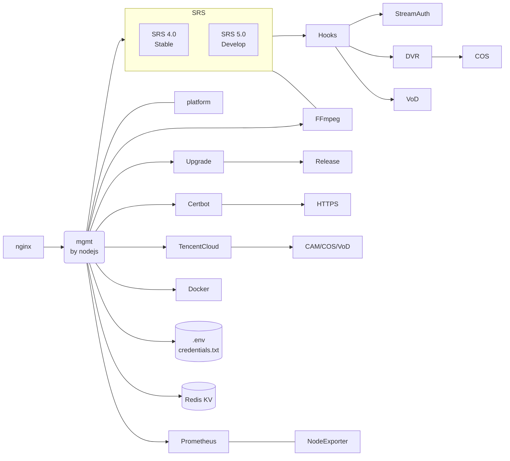

# SRS-Cloud

A lightweight open-source video cloud based on Nodejs, SRS, FFmpeg, WebRTC, etc.

## Usage: LightHouse

- [x] [Getting Started](https://mp.weixin.qq.com/s/fWmdkw-2AoFD_pEmE_EIkA).
- [x] [Live Streaming](https://mp.weixin.qq.com/s/AKqVWIdk3SBD-6uiTMliyA).
- [x] [Realtime SRT Streaming](https://mp.weixin.qq.com/s/HQb3gLRyJHHu56pnyHerxA).
- [x] [Automatical HTTPS](https://mp.weixin.qq.com/s/O70Fz-mxNedZpxgGXQ8DsA).
- [x] [Dashboard by Prometheus](https://mp.weixin.qq.com/s/ub9ZGmntOy_-S11oxFkxvg).
- [x] [DVR to Cloud Storage or VoD](https://mp.weixin.qq.com/s/UXR5EBKZ-LnthwKN_rlIjg).

Other more use scenarios is on the way, please read [this post](https://github.com/ossrs/srs/issues/2856#lighthouse).

## Architecture

The architecture of [srs-cloud](https://github.com/ossrs/srs-cloud#architecture) by 
[mermaid](https://mermaid.live/edit#pako:eNptkstuwjAQRX_F8qICiUcX7YZWSIiAkPpCCWWTsHDiIUmJ7cgZUxDqv9d2-gJ1kfH4zpncySgnmikOdES3lXrPCqaRPIZ3iSRE5qU8kH5_TEQusOPCfaqH4_RIpG15a7oea0yaa1YXJAojLxCXhbEN5GZw7VsiZGkFm99y4Mu3X-UA9lCpuq2D5O5wdt7cge5cKLVrWgU1MDExWJArEqxDG9cq8M3u5pDpSzvLz1vmc1FD_lfrk7piuFVaeLW16f8Djslrbb-Qg89DqIA1cA5MQWOq2nyxWi0vzFcgM5A4rZThLT95iu0ztGMO7eibc3yplQAswDR-ome77NmhVhpBn4OBynaX2kzu484A5N5vNtPArXPJqmaAB-xeOIXAyybu-IM8rG2Z9qgALVjJ7S9xcnBC7SgCEjqyKYctMxUmNJEfFjU1ZwgzXqLSdITaQI8ygyo6yuz73jJByewORSt-fALuq8V0)



> Note: It's a single node, also light-weighted, video cloud for tiny company, personal user and starter.

## Ports

The ports allocated:

| Module | TCP Ports | UDP Ports | Notes |
| ------ | --------- | --------- | ----- |
| SRS | 1935, 1985, 8080,<br/> 8088, 1990, 554,<br/> 8936 | 8000, 8935, 10080,<br/> 1989 | See [SRS ports](https://github.com/ossrs/srs/blob/develop/trunk/doc/Resources.md#ports) |
| platform | 2024 |  - | Mount at `/terraform/v1/mgmt/` |
| releases | 2023 |  - | Mount at `/terraform/v1/releases` |
| mgmt | 2022 |  - | Mount at `/mgmt/` and `/terraform/v1/mgmt/` |
| hooks | 2021 |  - | Mount at `/terraform/v1/hooks/` |
| tencent-cloud | 2020 |  - | Mount at `/terraform/v1/tencent/` |
| ffmpeg | 2019 |  - | Mount at `/terraform/v1/ffmpeg/` |
| prometheus | 9090 | - | Mount at `/prometheus` |
| node-exporter | 9100 | - | - |

## Features

The features that we're developing:

* [x] A mgmt support authentication and automatic updates.
* [x] Run SRS in docker, query status by docker and SRS API.
* [x] Support publish by RTMP/WebRTC, play by RTMP/HTTP-FLV/HLS/WebRTC.
* [x] SRS container use docker logs `json-file` and rotate for logging.
* [x] Support high-resolution and realtime(200~500ms) live streaming by SRT.
* [x] Run SRS hooks in docker, to callback by SRS server.
* [x] Support publish by SRT, play by RTMP/HTTP-FLV/HLS/WebRTC/SRT.
* [x] Integrate with prometheus and node-exporter.
* [x] Support DVR to tencent cloud storage, see [#1193](https://github.com/ossrs/srs/issues/1193).
* [x] Change redis port and use randomly password.
* [x] Support integrity with tencent cloud VoD.
* [x] Forward stream to multiple platforms, see [#2676](https://github.com/ossrs/srs/issues/2676).
* [ ] Support install script for CentOS 7. 
* [ ] Support GB28181 by SRS 5.0 container.
* [ ] Support live streaming transcoding by FFmpeg, see [#2869](https://github.com/ossrs/srs/issues/2869).
* [ ] Support virtual live streaming, covert file or other resource to live.
* [ ] Support WebRTC face to face chat, see [#2857](https://github.com/ossrs/srs/issues/2857).
* [ ] Support WebRTC video chat room, see [#2924](https://github.com/ossrs/srs/issues/2924).
* [ ] Support a set of tools for developer, see [#2891](https://github.com/ossrs/srs/issues/2891).
* [ ] Collect logs of mgmt and containers together.
* [ ] Stop, restart and upgrade containers.
* [ ] Support logrotate to manage the logs.
* [ ] Enhance prometheus API with authentication.

## APIs

Mgmt:

* `/terraform/v1/host/versions` Public version api.
* `/terraform/v1/host/exec` Exec command sync, response the stdout and stderr.
* `/terraform/v1/releases` Version management for all components.
* `/.well-known/acme-challenge/` HTTPS verify mount for letsencrypt.

Platform:

* `/terraform/v1/mgmt/versions` Public version api.
* `/terraform/v1/mgmt/init` Whether mgmt initialized.
* `/terraform/v1/mgmt/check` Check whether system is ok.
* `/terraform/v1/mgmt/token` System auth with token.
* `/terraform/v1/mgmt/login` System auth with password.
* `/terraform/v1/mgmt/status` Query the version of mgmt.
* `/terraform/v1/mgmt/upgrade` Upgrade the mgmt to latest version.
* `/terraform/v1/mgmt/strategy` Toggle the upgrade strategy.
* `/terraform/v1/mgmt/ssl` Config the system SSL config.
* `/terraform/v1/mgmt/letsencrypt` Config the let's encrypt SSL.
* `/terraform/v1/mgmt/pubkey` Update the access for platform administrator pubkey.
* `/terraform/v1/mgmt/containers` Query and upgrade SRS container.
* `/terraform/v1/mgmt/bilibili` Query the video information.
* `/terraform/v1/mgmt/beian/query` Query the beian information.
* `/terraform/v1/mgmt/beian/update` Update the beian information.
* `/terraform/v1/mgmt/window/query` Query the upgrade time window.
* `/terraform/v1/mgmt/window/update` Update the upgrade time window.
* `/terraform/v1/mgmt/secret/query` Query the api secret for OpenAPI.
* `/terraform/v1/mgmt/secret/token` Create token for OpenAPI.

Market:

* `/terraform/v1/hooks/srs/verify` Hooks: Verify the stream request URL of SRS.
* `/terraform/v1/hooks/srs/secret/query` Hooks: Query the secret to generate stream URL.
* `/terraform/v1/hooks/srs/secret/update` Hooks: Update the secret to generate stream URL.
* `/terraform/v1/hooks/srs/hls` Hooks: Handle the `on_hls` event.
* `/terraform/v1/hooks/dvr/apply` Hooks: Apply the DVR pattern.
* `/terraform/v1/hooks/dvr/query` Hooks: Query the DVR pattern.
* `/terraform/v1/hooks/dvr/files` Hooks: List the DVR files.
* `/terraform/v1/hooks/dvr/hls` Hooks: Generate HLS/m3u8 url to preview or download.
* `/terraform/v1/hooks/vod/query` Hooks: Query the VoD pattern.
* `/terraform/v1/hooks/vod/apply` Hooks: Apply the VoD pattern.
* `/terraform/v1/hooks/vod/files` Hooks: List the VoD files.
* `/terraform/v1/hooks/vod/hls` Hooks: Generate HLS/m3u8 url to preview or download.
* `/terraform/v1/tencent/cam/secret` Tencent: Setup the CAM SecretId and SecretKey.
* `/terraform/v1/ffmpeg/forward/secret` FFmpeg: Setup the forward secret to live streaming platforms.
* `/terraform/v1/ffmpeg/forward/streams` FFmpeg: Query the forwarding streams.
* `/prometheus` Prometheus: Time-series database and monitor.
* `/api/` SRS: HTTP API of SRS media server.
* `/rtc/` SRS: HTTP API for WebERTC of SRS media server.
* `/*/*.(flv|m3u8|ts|aac|mp3)` SRS: Media stream for HTTP-FLV, HLS, HTTP-TS, HTTP-AAC, HTTP-MP3.

Static Files:

* `/tools/` A set of H5 tools, like simple player, xgplayer, etc, serve by mgmt.
* `/console/` The SRS console, serve by mgmt.
* `/players/` The SRS player, serve by mgmt.
* `/mgmt/` The ui for mgmt, serve by mgmt.

## Depends

The software we depend on:

* Docker, `yum install -y docker`
* Redis, `yum install -y redis`
* Nginx, `yum install -y nginx`
  * SSL: `/etc/nginx/ssl`
* [Certbot](https://github.com/ossrs/srs/issues/2864#lets-encrypt), `docker --name certbot`
  * Verify webroot: `mgmt/containers/www/.well-known/acme-challenge/`
  * Cert files: `mgmt/containers/etc/letsencrypt/live/`
* [SRS](https://github.com/ossrs/srs), `docker --name srs-server`
  * Config: `mgmt/containers/conf/srs.conf` mount as `/usr/local/srs/conf/lighthouse.conf`
  * Volume: `mgmt/containers/objs/nginx/html` mount as `/usr/local/srs/objs/nginx/html`
* [srs-hooks](https://github.com/ossrs/srs-cloud/tree/lighthouse/hooks), `docker --name srs-hooks`
  * Volume: `mgmt/containers/objs/nginx/html` mount as `/usr/local/mgmt/containers/objs/nginx/html`
* [tencent-cloud](https://github.com/ossrs/srs-cloud/tree/lighthouse/tencent), `docker --name tencent-cloud`
  * [CAM](https://console.cloud.tencent.com/cam/overview) Authentication by secretId and secretKey.
* [ffmpeg](https://github.com/ossrs/srs-cloud/tree/lighthouse/ffmpeg), `docker --name ffmpeg`
  * [FFmpeg and ffprobe](https://ffmpeg.org) tools in `ossrs/srs:node-av`
* [Prometheus](https://github.com/prometheus/prometheus#install), `docker --name prometheus`
  * Config: `mgmt/containers/conf/prometheus.yml`
  * Data directory: `mgmt/containers/data/prometheus`
* [NodeExporter](https://github.com/prometheus/node_exporter), `docker --name node-exporter`

## Upgrade Workflow

When upgrading automatically or manually by user:

* `bash upgrade` for each upgrade.
* `bash auto/upgrade_region` to setup the source by region.
* `git checkout` to checkout to specified tag or branch.
* `bash upgrade_living` to run with the updated scripts.
* `bash auto/upgrade_prepare` do upgrade for previous images.
* `bash auto/upgrade_nginx` to upgrade the nginx configuration.
* `bash auto/foreach_run` to setup swap and redis configuration.
* `bash auto/upgrade_ui` to upgrade the ui.
* `systemctl restart srs-terraform` to restart the mgmt service.

When system start, check the flag `SRS_FIRST_BOOT` in redis, if not set:

* Always restart container platform to use the correct image version, which should be same to mgmt.
* Restart containers for the host ip might change.

They are not mutually exclusive. To force to upgrade to a branch:

```bash
~lighthouse/redis-cli hset SRS_UPGRADING force main
systemctl restart srs-terraform
```

> Note: Please set the upgrade window to [0, 24] to allow upgrade full time.

It will trigger the upgrading process immediately.

## System Boot

When system boot:

* Restart the mgmt service by `systemctl start srs-terraform`
* Execute script `bootstrap` at mgmt
* Run script `auto/foreach_run` at mgmt
* Start application by `node .` at mgmt

## System Setup

When user setup the system, the admin password for the first boot:

* Setup the `MGMT_PASSWORD` in `.env`
* Restat all containers that depends on `.env`

## Environments

The optional environments defined by `mgmt/.env`:

* `MGMT_PASSWORD`: The mgmt administrator password.
* `SRS_PLATFORM_SECRET`: The mgmt api secret for token generating and verifying.
* `CLOUD`: The cloud platform name, DEV for development.
* `REGION`: `ap-guangzhou|ap-singapore|sgp1`, The region for upgrade source.
* `SOURCE`: `github|gitee`, The source code for upgrading. 

For testing the specified service:

* `NODE_ENV`: `development|production`, if development, use local redis; otherwise, use `mgmt.srs.local` in docker.
* `LOCAL_RELEASE`: `true|false`, whether use local release service.

For github actions to control the containers:

* `SRS_DOCKER`: `srs` to enfore use `ossrs/srs` docker image.
* `USE_DOCKER`: `true|false`, if false, disable all docker containers.
* `SRS_UTEST`: `true|false`, if true, running in utest mode.

For mgmt and containers to connect to redis:

* `REDIS_PASSWORD`: The redis password.
* `REDIS_PORT`: The redis port.

Environments for react ui:

* `PUBLIC_URL`: The mount prefix.
* `BUILD_PATH`: The output build path, default to `build`.
* `REACT_APP_LOCALE`: The i18n config for ui, `en` or `zh`, default to `zh`.

> Note: The env for react must start with `REACT_APP_`, please read [this post](https://create-react-app.dev/docs/adding-custom-environment-variables/#referencing-environment-variables-in-the-html).

## Develop

Install dependencies:

```bash
(cd mgmt && npm install)
(cd platform && npm install)
(cd platform/ui && npm install)
```

Run the mgmt backend:

```
(cd mgmt && npm start)
```

Run the platform backend:

```
(cd platform && npm start)
```

Run the platform react ui:

```
(cd platform/ui && npm start)
```

Access the browser: http://localhost:3000

