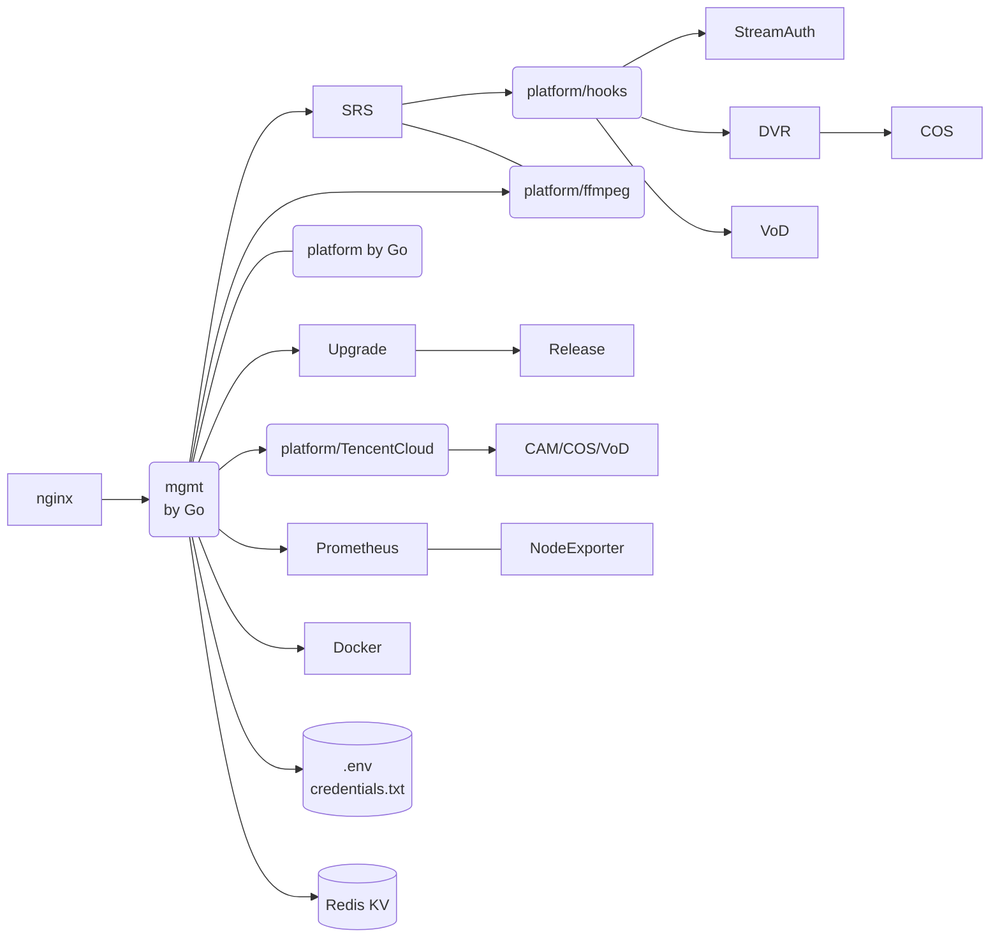
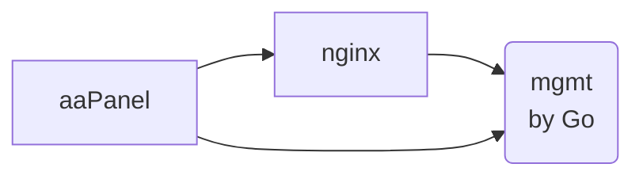

# SRS-Cloud

[](https://twitter.com/srs_server)
[](https://discord.gg/bQUPDRqy79)
[](https://cloud.digitalocean.com/droplets/new?appId=133468816&size=s-1vcpu-512mb-10gb&region=sgp1&image=ossrs-srs&type=applications)

A lightweight open-source video cloud based on Nodejs, SRS, FFmpeg, WebRTC, etc.

## Usage

Run srs-cloud in one docker:

```bash
docker run --rm -it -p 2022:2022 -p 1935:1935/tcp -p 1985:1985/tcp \
  -p 8080:8080/tcp -p 8000:8000/udp -p 10080:10080/udp --name srs-cloud \
  ossrs/srs-cloud:platform-1
```

> Note: Please use `registry.cn-hangzhou.aliyuncs.com/ossrs/srs-cloud:platform-1` in China.

Then open http://localhost:2022/mgmt in browser.

Then open http://localhost:2022/mgmt in browser.

All data will be reset when restarting, so please mount volumes if want to save data to local disk:

```bash
docker run --rm -it -p 2022:2022 -p 1935:1935/tcp -p 1985:1985/tcp \
  -p 8080:8080/tcp -p 8000:8000/udp -p 10080:10080/udp --name srs-cloud \
  -v $HOME/db:/data ossrs/srs-cloud:platform-1
```

You have the option to modify the volumes for srs-cloud and direct them to different directories.

* `/data` The global data directory.
    * `redis` The redis data directory, the publish secret and record configuration.
    * `srs-cloud` The data directory for srs-cloud
        * `config` The mgmt password and cloud configuration.
        * `record` The record storage directory, save record files.
        * `vlive` The storage directory for virtual live, save video files.

You can use environment variables to modify the settings.

* `MGMT_PASSWORD`: The mgmt administrator password.
* `REACT_APP_LOCALE`: The i18n config for ui, `en` or `zh`, default to `zh`.

> Note: Kindly utilize the command such as `docker run -e REACT_APP_LOCALE=en` to modify the environment.

To access additional environment variables, please refer to the [Environments](#environments) section.

## FAQ

1. [English FAQ](https://ossrs.io/lts/en-us/faq-srs-cloud)
1. [中文 FAQ](https://ossrs.net/lts/zh-cn/faq-srs-cloud)

## Tutorials

- [x] [Getting Started](https://mp.weixin.qq.com/s/fWmdkw-2AoFD_pEmE_EIkA).
- [x] [Live Streaming](https://mp.weixin.qq.com/s/AKqVWIdk3SBD-6uiTMliyA).
- [x] [Realtime SRT Streaming](https://mp.weixin.qq.com/s/HQb3gLRyJHHu56pnyHerxA).
- [x] [DVR to Cloud Storage or VoD](https://mp.weixin.qq.com/s/UXR5EBKZ-LnthwKN_rlIjg).
- [x] [Support WordPress Plugin](https://mp.weixin.qq.com/s/YjTkcJLkErMcZYHIjzsW_w) or [here](https://wordpress.org/plugins/srs-player).
- [x] [Support Typecho Plugin](https://github.com/ossrs/Typecho-Plugin-SrsPlayer).
- [x] [Support aaPanel to install on any linux](https://github.com/ossrs/srs-cloud/issues/29).
- [x] [Support DVR to local disk](https://github.com/ossrs/srs-cloud/issues/42).
- [x] [Support Virtual Live Streaming](https://mp.weixin.qq.com/s/I0Kmxtc24txpngO-PiR_tQ).
- [ ] [Automatical HTTPS](https://mp.weixin.qq.com/s/O70Fz-mxNedZpxgGXQ8DsA).
- [ ] [Dashboard by Prometheus](https://mp.weixin.qq.com/s/ub9ZGmntOy_-S11oxFkxvg).

Other more use scenarios is on the way, please read [this post](https://github.com/ossrs/srs/issues/2856#lighthouse).

## Architecture

The architecture of [srs-cloud](https://github.com/ossrs/srs-cloud#architecture) by 
[mermaid](https://mermaid.live/edit#pako:eNqNkctuwjAQRX_F8qIKEiH7tEKqCLRSXyhp2ZAuTDx5iNiOnDEFIf69jtMWwqoL2zPjozt37CPNFAca0rxWX1nJNJLn-DaVhMiiknvi-1MiCoFet91tdDDdHMiDGjmkqzkiiRN3Piq1bb2mZpgrLYKyS0c9gRqYuDdYkhsSrWK7r1TkVLqsQ2ZvyVB1sRANFGe5PO_yQWufLH9u_zByYbD35f9HaUo-mkIzDi6OoQbWwhB4B5mBxFmtDD9rXVb7WWf3L2u7AjtQYIf8HKostRKAJZjWWXu1zz_fN0oj6CEYqWx7XZvL3dqbgNy5r8g0cNu6YnU7wT2OrjrFwKt27bmDPK3sNR1TAVqwitsfP3ZwSq0VASkNbcghZ6bGlKbyZFHTcIYw5xUqTUPUBsaUGVTJQWa_ec9EFbNvJ2iYWytw-gba_8FA)



> Note: It's a single node, also light-weighted, video cloud for tiny company, personal user and starter.



> Note: This is an optional workflow for user to use aaPanel to deploy srs-cloud.

## Ports

The ports allocated:

| Module | TCP Ports | UDP Ports | Notes                                                                                   |
| ------ | --------- | --------- |-----------------------------------------------------------------------------------------|
| SRS | 1935, 1985, 8080,<br/> 8088, 1990, 554,<br/> 8936 | 8000, 8935, 10080,<br/> 1989 | See [SRS ports](https://github.com/ossrs/srs/blob/develop/trunk/doc/Resources.md#ports) |
| platform | 2024 |  - | Mount at `/terraform/v1/mgmt/`, `/terraform/v1/hooks/`, `/terraform/v1/ffmpeg/` and `/terraform/v1/tencent/`    |
| releases | 2023 |  - | Mount at `/terraform/v1/releases`                                                       |
| mgmt | 2022 |  - | Mount at `/mgmt/` and `/terraform/v1/mgmt/`                                             |
| node-exporter | 9100 | - | -                                                                                       |
| redis | 56379 | - | -                                                                                       |

> Note: Hooks(2021) has been migrated to platform(2024).

> Note: FFmpeg(2019) has been migrated to platform(2024).

> Note: TencentCloud(2020) has been migrated to platform(2024).

## Features

The features that we're developing:

- [x] A mgmt support authentication and automatic updates.
- [x] Run SRS in docker, query status by docker and SRS API.
- [x] Support publish by RTMP/WebRTC, play by RTMP/HTTP-FLV/HLS/WebRTC.
- [x] SRS container use docker logs `json-file` and rotate for logging.
- [x] Support high-resolution and realtime(200~500ms) live streaming by SRT.
- [x] Run SRS hooks in docker, to callback by SRS server.
- [x] Support publish by SRT, play by RTMP/HTTP-FLV/HLS/WebRTC/SRT.
- [x] Support DVR to tencent cloud storage, see [#1193](https://github.com/ossrs/srs/issues/1193).
- [x] Change redis port and use randomly password.
- [x] Support integrity with tencent cloud VoD.
- [x] Forward stream to multiple platforms, see [#2676](https://github.com/ossrs/srs/issues/2676).
- [x] [Support WordPress Plugin](https://mp.weixin.qq.com/s/YjTkcJLkErMcZYHIjzsW_w) or [here](https://wordpress.org/plugins/srs-player).
- [x] [Support Typecho Plugin](https://github.com/ossrs/Typecho-Plugin-SrsPlayer).
- [x] [Support aaPanel to install on any linux](https://github.com/ossrs/srs-cloud/issues/29).
- [x] [Support DVR to local disk](https://github.com/ossrs/srs-cloud/issues/42).
- [ ] Support upgrade to latest version manually.
- [ ] Support HTTPS by let's encrypt with certbot.
- [ ] Support GB28181 by SRS 5.0 container.
- [ ] Support live streaming transcoding by FFmpeg, see [#2869](https://github.com/ossrs/srs/issues/2869).
- [ ] Support virtual live streaming, covert file or other resource to live.
- [ ] Support WebRTC face to face chat, see [#2857](https://github.com/ossrs/srs/issues/2857).
- [ ] Support WebRTC video chat room, see [#2924](https://github.com/ossrs/srs/issues/2924).
- [ ] Support a set of tools for developer, see [#2891](https://github.com/ossrs/srs/issues/2891).
- [ ] Collect logs of mgmt and containers together.
- [ ] Stop, restart and upgrade containers.
- [ ] Support logrotate to manage the logs.
- [ ] Enhance prometheus API with authentication.
- [ ] Integrate with prometheus and node-exporter.

## APIs

Mgmt:

* `/terraform/v1/host/versions` Public version api.
* `/terraform/v1/host/exec` Exec command sync, response the stdout and stderr.
* `/terraform/v1/releases` Version management for all components.

Platform:

* `/terraform/v1/mgmt/versions` Public version api.
* `/terraform/v1/mgmt/init` Whether mgmt initialized.
* `/terraform/v1/mgmt/check` Check whether system is ok.
* `/terraform/v1/mgmt/token` System auth with token.
* `/terraform/v1/mgmt/login` System auth with password.
* `/terraform/v1/mgmt/status` Query the version of mgmt.
* `/terraform/v1/mgmt/envs` Query the envs of mgmt.
* `/terraform/v1/mgmt/bilibili` Query the video information.
* `/terraform/v1/mgmt/beian/query` Query the beian information.
* `/terraform/v1/mgmt/beian/update` Update the beian information.
* `/terraform/v1/mgmt/secret/query` Query the api secret for OpenAPI.
* `/terraform/v1/mgmt/secret/token` Create token for OpenAPI.
* `/terraform/v1/mgmt/nginx/hls` Update NGINX config, to enable HLS delivery.

Also by platform module:

* `/terraform/v1/hooks/srs/verify` Hooks: Verify the stream request URL of SRS.
* `/terraform/v1/hooks/srs/secret/query` Hooks: Query the secret to generate stream URL.
* `/terraform/v1/hooks/srs/secret/update` Hooks: Update the secret to generate stream URL.
* `/terraform/v1/hooks/srs/secret/disable` Hooks: Disable the secret for authentication.
* `/terraform/v1/hooks/srs/hls` Hooks: Handle the `on_hls` event.
* `/terraform/v1/hooks/record/query` Hooks: Query the Record pattern.
* `/terraform/v1/hooks/record/apply` Hooks: Apply the Record pattern.
* `/terraform/v1/hooks/record/remove` Hooks: Remove the Record files.
* `/terraform/v1/hooks/record/files` Hooks: List the Record files.
* `/terraform/v1/hooks/record/hls/:uuid.m3u8` Hooks: Generate HLS/m3u8 url to preview or download.
* `/terraform/v1/hooks/record/hls/:uuid/index.m3u8` Hooks: Serve HLS m3u8 files.
* `/terraform/v1/hooks/record/hls/:dir/:m3u8/:uuid.ts` Hooks: Serve HLS ts files.
* `/terraform/v1/hooks/dvr/apply` Hooks: Apply the DVR pattern.
* `/terraform/v1/hooks/dvr/query` Hooks: Query the DVR pattern.
* `/terraform/v1/hooks/dvr/files` Hooks: List the DVR files.
* `/terraform/v1/hooks/dvr/hls/:uuid.m3u8` Hooks: Generate HLS/m3u8 url to preview or download.
* `/terraform/v1/hooks/vod/query` Hooks: Query the VoD pattern.
* `/terraform/v1/hooks/vod/apply` Hooks: Apply the VoD pattern.
* `/terraform/v1/hooks/vod/files` Hooks: List the VoD files.
* `/terraform/v1/hooks/vod/hls/:uuid.m3u8` Hooks: Generate HLS/m3u8 url to preview or download.
* `/terraform/v1/tencent/cam/secret` Tencent: Setup the CAM SecretId and SecretKey.
* `/terraform/v1/ffmpeg/forward/secret` FFmpeg: Setup the forward secret to live streaming platforms.
* `/terraform/v1/ffmpeg/forward/streams` FFmpeg: Query the forwarding streams.

Market:

* `/api/` SRS: HTTP API of SRS media server.
* `/rtc/` SRS: HTTP API for WebERTC of SRS media server.
* `/*/*.(flv|m3u8|ts|aac|mp3)` SRS: Media stream for HTTP-FLV, HLS, HTTP-TS, HTTP-AAC, HTTP-MP3.

Static Files:

* `/tools/` A set of H5 tools, like simple player, xgplayer, etc, serve by mgmt.
* `/console/` The SRS console, serve by mgmt.
* `/players/` The SRS player, serve by mgmt.
* `/mgmt/` The ui for mgmt, serve by mgmt.

**Removed** API:

* `/terraform/v1/mgmt/strategy` Toggle the upgrade strategy.
* `/prometheus` Prometheus: Time-series database and monitor.
* `/terraform/v1/mgmt/nginx/proxy` Setup a reverse proxy location.
* `/terraform/v1/mgmt/dns/lb` HTTP-DNS for hls load balance.
* `/terraform/v1/mgmt/dns/backend/update` HTTP-DNS: Update the backend servers for hls load balance.
* `/terraform/v1/mgmt/nginx/homepage` Setup the homepage redirection.
* `/terraform/v1/mgmt/window/query` Query the upgrade time window.
* `/terraform/v1/mgmt/window/update` Update the upgrade time window.
* `/.well-known/acme-challenge/` HTTPS verify mount for letsencrypt.
* `/terraform/v1/mgmt/ssl` Config the system SSL config.
* `/terraform/v1/mgmt/letsencrypt` Config the let's encrypt SSL.
* `/terraform/v1/mgmt/pubkey` Update the access for platform administrator pubkey.
* `/terraform/v1/mgmt/upgrade` Upgrade the mgmt to latest version.
* `/terraform/v1/mgmt/containers` Query SRS container.

## Depends

The software we depend on:

* Docker, `apt-get install -y docker.io`
  * Redis, `apt-get install -y redis`
  * Nginx, `apt-get install -y nginx`
    * SSL: `mgmt/containers/ssl`
* [Certbot](https://github.com/ossrs/srs/issues/2864#lets-encrypt), `docker --name certbot`
  * Verify webroot: `mgmt/containers/www/.well-known/acme-challenge/`
  * Cert files: `mgmt/containers/etc/letsencrypt/live/`
* [SRS](https://github.com/ossrs/srs), `docker --name srs-server`
  * Config: `mgmt/containers/conf/srs.conf` mount as `/usr/local/srs/conf/lighthouse.conf`
  * Volume: `mgmt/containers/objs/nginx/html` mount as `/usr/local/srs/objs/nginx/html`
* [srs-hooks](https://github.com/ossrs/srs-cloud/tree/lighthouse/hooks), `docker --name srs-hooks`
  * Volume: `mgmt/containers/objs/nginx/html` mount as `/usr/local/mgmt/containers/objs/nginx/html`
* [tencent-cloud](https://github.com/ossrs/srs-cloud/tree/lighthouse/tencent), `docker --name tencent-cloud`
  * [CAM](https://console.cloud.tencent.com/cam/overview) Authentication by secretId and secretKey.
* [ffmpeg](https://github.com/ossrs/srs-cloud/tree/lighthouse/ffmpeg), `docker --name ffmpeg`
  * [FFmpeg and ffprobe](https://ffmpeg.org) tools in `ossrs/srs:node-av`

## Environments

The optional environments defined by `mgmt/.env`:

* `CLOUD`: `dev|bt|aapanel|droplet|docker`, The cloud platform name, DEV for development.
* `REGION`: `ap-guangzhou|ap-singapore|sgp1`, The region for upgrade source.
* `SOURCE`: `github|gitee`, The source code for upgrading. 
* `REGISTRY`: `docker.io|registry.cn-hangzhou.aliyuncs.com`, The docker registry.
* `MGMT_LISTEN`: The listen port for mgmt HTTP server. Default: 2022
* `PLATFORM_LISTEN`: The listen port for platform HTTP server. Default: 2024
* `SRS_DOCKERIZED`: `true|false` Indicates the OS is in docker.

For mgmt to start platform in docker, because it can't access redis which is started by platform:

* `PLATFORM_DOCKER`: Whether run platform in docker. Default: true
* `MGMT_DOCKER`: Whether run mgmt in docker. Default: false

For testing the specified service:

* `NODE_ENV`: `development|production`, if development, use local redis; otherwise, use `mgmt.srs.local` in docker.
* `LOCAL_RELEASE`: `true|false`, whether use local release service.

For github actions to control the containers:

* `SRS_DOCKER`: `srs` to enfore use `ossrs/srs` docker image.
* `USE_DOCKER`: `true|false`, if false, disable all docker containers.
* `SRS_UTEST`: `true|false`, if true, running in utest mode.

For mgmt and containers to connect to redis:

* `REDIS_PASSWORD`: The redis password.
* `REDIS_PORT`: The redis port.

Environments for react ui:

* `PUBLIC_URL`: The mount prefix.
* `BUILD_PATH`: The output build path, default to `build`.

> Note: The env for react must start with `REACT_APP_`, please read [this post](https://create-react-app.dev/docs/adding-custom-environment-variables/#referencing-environment-variables-in-the-html).

Removed variables in .env:

* `SRS_PLATFORM_SECRET`: The mgmt api secret for token generating and verifying.

Please restart service when `.env` changed.

## Develop All in macOS

Start redis by docker:

```bash
docker run --name redis -d --rm -it -v $HOME/db/redis:/data -p 6379:6379 redis
```

Start SRS in macOS:

```bash
(cd platform && ~/git/srs/trunk/objs/srs -c containers/conf/srs.release-local.conf)
```

Run the mgmt backend, or run in GoLand:

```
(cd mgmt && bash auto/init_global && PLATFORM_DOCKER=false go run .)
```

Run the platform backend, or run in GoLand:

```
(cd platform && go run .)
```

Run the platform react ui, or run in WebStorm:

```
(cd platform/ui && npm install && npm start)
```

Access the browser: http://localhost:3000

## Develop All in One Docker

Run srs-cloud in a docker.

First, build image:

```bash
docker build -t platform-dev -f platform/Dockerfile.dev .
```

Then start the development docker:

```bash
docker run --rm -it -p 2022:2022 -p 2024:2024 --name platform -v $(pwd):/usr/local/srs-cloud \
  --add-host redis:127.0.0.1 --env REDIS_HOST=127.0.0.1 --add-host mgmt.srs.local:127.0.0.1 \
  --env CLOUD=DOCKER --env MGMT_DOCKER=true --env SRS_DOCKERIZED=true --env NODE_ENV=development \
  -p 1935:1935/tcp -p 1985:1985/tcp -p 8080:8080/tcp -p 8000:8000/udp -p 10080:10080/udp \
  platform-dev bash
```

> Note: We don't use the `/data` as global storage.

Start redis and SRS only in docker:

```bash
bash auto/init_mgmt && bash auto/start_redis && bash auto/start_srs
```

Build and run mgmt only in docker:

```bash
cd /usr/local/srs-cloud/mgmt && make && ./mgmt
```

Build and run platform only in docker:

```bash
docker exec -it platform bash -c 'make && ./platform'
```

Stop redis and SRS:

```bash
docker exec -it platform bash -c 'bash auto/stop_redis && bash auto/stop_srs'
```

It's the same as production online.

## Release

Release bugfix:

* For mgmt: `./auto/mgmt_platform_pub.sh`
* Then test the specified version of mgmt.

> Note: The [features](https://github.com/ossrs/srs-cloud/issues/4) might need to be updated.

Release version for BT and aaPanel:

* Then run `./auto/bt_aapanel_pub.sh`
* Finally, download [bt-srs_cloud.zip](https://github.com/ossrs/srs-cloud/releases) then submit to [bt.cn](https://www.bt.cn/developer/details.html?id=600801805)

> Note: The [BT forum](https://www.bt.cn/bbs/thread-90890-1-1.html) and [FAQ](https://github.com/ossrs/srs-cloud/issues/4) might need to be updated.

To refresh current tag for mgmt and platform:

* Run `./auto/mgmt_platform_pub.sh -refresh`

The upgrade feature has been disabled, which means we no longer update the 
[version API](https://api.ossrs.net/terraform/v1/releases), nor do we update
the `releases/version.go` file, and we don't use `./auto/releases_pub.sh`.

2022.11

