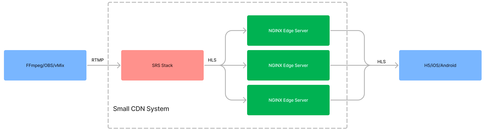
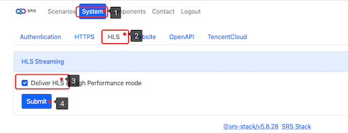

# NGINX-HLS-CDN

Construct a small CDN for HLS streaming using NGINX and SRS Stack.



> Note: Please view [this link](https://www.figma.com/file/EZcnUttzxZbHJcXRLjpuOZ/NGINX-HLS-CDN) for detail.

> Note: To utilize SRS, kindly refer to [Nginx for HLS](https://ossrs.io/lts/en-us/docs/v5/doc/nginx-for-hls) 
> for additional details. You can still follow this guide by proceeding directly to set up an NGINX server.

## Step 1: Create a VPS for SRS Stack

Create a Digital Ocean droplet, or use another VPS:

```bash
sshkey=$(doctl compute ssh-key list --no-header |grep srs |awk '{print $1}') &&
doctl compute droplet create srs-stack --image ubuntu-20-04-x64 \
    --region sgp1 --size s-2vcpu-2gb --ssh-keys $sshkey --wait
```

> Note: You can also access [DO Droplets](https://cloud.digitalocean.com/droplets) to create a new droplet.

You will receive an internet IP address, for example, `128.199.114.145`. Log in and run:

```bash
apt-get update -y && apt-get install -y docker.io curl net-tools ffmpeg pcp &&
docker rm -f srs-stack || echo OK &&
docker run --rm -p 2022:2022 -p 2443:2443 -p 1935:1935/tcp -p 1985:1985/tcp \
  -p 8080:8080/tcp -p 8000:8000/udp -p 10080:10080/udp --name srs-stack -d \
  -v $HOME/db:/data ossrs/srs-stack:5
```

After installation, you can access SRS Stack at [http://128.199.114.145:2022](http://128.199.114.145:2022).
Please configure the SRS Stack using the web console.

Open `System > HLS > Delivery HLS in High Performance mode` and click the `Submit` button. This will enable
high-performance HLS and allow NGINX to cache the m3u8 and ts files.



Then you can publish a stream to SRS Stack, for example, to use ffmpeg to push a stream:

```bash
ffmpeg -re -i ~/git/srs/trunk/doc/source.flv -c copy -f flv \
    rtmp://128.199.114.145/live/livestream?secret=61ea7c72e9204cb0bbf83e385fbaf9b2
```

> Note: Please replace the server IP and secret with your own.

Please check the stream by [http://128.199.114.145:2022/live/livestream.m3u8](http://128.199.114.145:2022/tools/player.html?url=http://128.199.114.145:2022/live/livestream.m3u8)

## Step 2: Create an NGINX Edge server

Create a Digital Ocean droplet, or use another VPS:

```bash
sshkey=$(doctl compute ssh-key list --no-header |grep srs |awk '{print $1}') &&
doctl compute droplet create srs-stack-nginx01 --image ubuntu-20-04-x64 \
    --region sgp1 --size s-4vcpu-8gb --ssh-keys $sshkey --wait
```

> Note: You can also access [DO Droplets](https://cloud.digitalocean.com/droplets) to create a new droplet.

> Note: We create a VPS with `4CPU 8GB` and `160GB` disk, because the load is larger than SRS Stack.

You will receive an internet IP address, for example, `128.199.93.163`. Log in and run:

```bash
apt-get update -y && apt-get install -y docker.io curl net-tools ffmpeg pcp &&
docker rm -f srs-stack-nginx01 || echo OK &&
docker run --rm -it -e SRS_STACK_SERVER=128.199.114.145:2022 \
    -p 80:80 --name srs-stack-nginx01 -d \
    ossrs/srs-stack:nginx-hls-cdn
```

> Note: Please replace the IP `128.199.114.145` with your SRS Stack.

A HLS stream should be available at [http://128.199.93.163/live/livestream.m3u8](http://128.199.114.145:2022/tools/player.html?url=http://128.199.93.163/live/livestream.m3u8),
and in the following steps, you can create more NGINX servers to deliver HLS stream.

This step can be repeated multiple times to establish more NGINX edge servers, allowing you to serve 
a greater number of clients. Additionally, you can configure NGINX servers to retrieve HLS streams 
from other NGINX servers, creating a new layer of servers that can support millions of viewers.

## Step 3: Test the NGINX Edge server

You can use srs-bench to test the NGINX server, for example, to simulate 500 clients to play HLS stream:

```bash
docker run --rm -d ossrs/srs:sb ./objs/sb_hls_load \
    -c 500 -r http://128.199.93.163/live/livestream.m3u8
```

Check the bandwidth by dstat:

```bash
dstat -Nlo,eth0,eth1
```

All network traffic will be handled and transmitted by nginx01 instead of the SRS Stack. This structure 
allows for the expansion and addition of more NGINX servers to accommodate more viewers, potentially 
supporting thousands or even millions. Since the SRS Stack only needs to serve the NGINX servers, the 
load will consistently remain low.

 